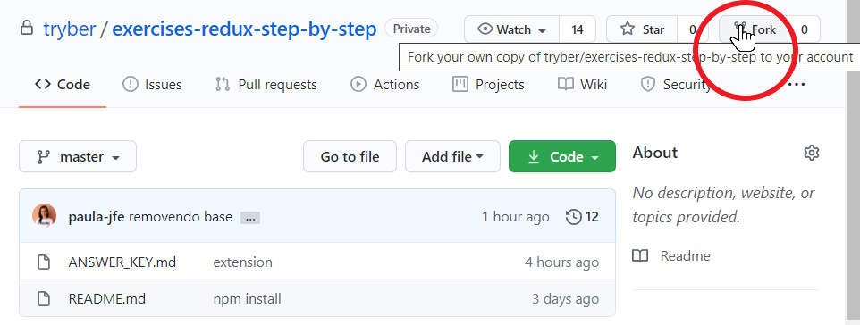

# Boas vindas ao exercício de Gerenciamento de estados complexos com Context API e React Hooks

# Orientações

<details>
  <summary><strong>‼️ Antes de começar a desenvolver</strong></summary><br />

**1 - Clique no botão "Fork" do repositório.**



**2 - Selecione seu usuário do GitHub.**


**3 - Escolha a URL remota (SSH, HTTPS) para fazer o clone do repositório.**


</details><br />

<details>
    <summary><b> 🛠️ Esquema de pastas e arquivos</b></summary>


- **try-food:** Diretório com toda a aplicação.
- **src:** Diretório que contém seu código JavaScript, JSX.
- **components:** Diretório que contém os componentes utilizados na aplicação.
- **context:** Diretório que contém o contexto da aplicação e o provedor de estados da sua aplicação.
- **pages:** Diretório que contém as páginas da aplicação, ou seja, as páginas configuradas por rotas.
- **index.js:** Arquivo que trata de encontrar o arquivo raiz da aplicação e implementa o código React nele. O index.js importa a biblioteca react-dom e contém o BrowserRouter, que realiza a implementação de rotas para navegadores HTML5 e informa a aplicação que teremos roteamento de componentes a partir daquele ponto. Esta implementação encapsula App.js.
- **App.js:** Arquivo que representa o elemento raiz da aplicação, a partir dele haverá ramificações. Esta implementação encapsula Routes.js.
- **Routes.js:** Arquivo que centraliza todas as rotas da aplicação (boa prática).

</details><br />

<details>
  <summary><strong>👨‍💻 O que deverá ser desenvolvido</strong></summary><br />

Para iniciar, acesse o diretório `try-food` e execute o comando `npm install`.

```bash
cd try-food
npm install
npm start
```

Após executar o `npm start`, você entrará na página de login. Faça o login com qualquer e-mail e senha com mais de 6 dígitos. Com isso, você será direcionado para a página `order`. Essa página contém uma lista de comidas, bebidas e sobremesas. Cada item possui um _input_ do tipo `number`, que você pode utilizar para adicionar ou remover itens na sua sacola.

**Ao tentar adicionar algum item à sacola, alterando o valor do _input_, um erro será disparado e irá quebrar a aplicação.**

O seu objetivo nesses exercícios será **implementar o contexto da aplicação**.

Toda a lógica principal da aplicação já está desenvolvida, você precisará alterar apenas o arquivo `./src/context/MyProvider.js`. Será necessário criar três casos diferentes:

1. Adicionar um novo item à sacola;
2. Alterar a quantidade de um item já existente na sacola;
3. Remover um item da sacola, quando a sua quantidade for zero;

Para isso, você deve implementar quatro funções no `Provider`:

- `handleChange`: Essa função é utilizada nos componentes da aplicação. Como o seu nome sugere, ela é a responsável por lidar com as alterações no _input_. Ela que será a responsável por executar as funções abaixo;
- `addNewItem`: Essa função é a responsável pela lógica ao adicionar um novo item à lista;
- `updateItem`: Essa função é a responsável por alterar a quantidade de um item que já está na sacola;
- `removeItem`: Essa função é a responsável por remover um item da sacola, quando a sua quantidade for zero.

</details><br />

# Exercícios

## Exercício 1 - Atualize a função `handleChange`.

No arquivo `./src/context/MyProvider.js`, atualize a função `handleChange` de modo que, caso o item que está sendo alterado já esteja na sacola (ou seja, se o item já estiver no estado `orderList` do `Provider`), ele deve chamar a função `manageItemsInList`. Caso contrário, ele deve chamar a função `addNewItem`.

<details>
<summary><b>Dicas:</b></summary>

- Os parâmetros da função se referem ao seguinte:
    - `target`: Se refere ao input que está sendo utilizado. Use-o para recuperar o valor de `value`;
    - `itemName`: O nome do produto;
    - `itemType`: O tipo do produto (comida, bebida ou sobremesa);
    - `itemPrice`: O preço do produto.
- A constante `value`, que já está criada na função, se refere ao _valor_ recebido no `input`. Por exemplo, se a pessoa usuária adicionar o valor `2` no input do item `Chimarrão`, o valor de `value` será `2`;
- A constante `newItem` está criando um objeto com todas as informações necessárias para aplicação. Ou seja, ele está "pronto" para ser salvo no estado do `Provider`.
- Utilize a variável `isPresentInList` para salvar o resultado da verificação de um item já existe na lista ou não.

</details>

## Exercício 2 - Implemente a função `addNewItem`.

No arquivo `./src/context/MyProvider.js`, implemente a função `addNewItem` de modo que, quando for chamada, adicione o objeto `newItem` ao estado do `Provider`. Utilize o valor de `newItem.itemType` para descobrir se o item deve ser salvo como `comida`, `bebida` ou `sobremesa`.

<details>
<summary><b>Dica:</b></summary> 

- Ao salvar novos itens no estado, cuidado para não excluir os itens já existentes;

</details>

## Exercício 3 - Implemente as funções `updateItem` e `removeItem`.

As duas funções são executadas dentro da função `manageItemsInList`, que é executada na função `handleChange` quando o item que está sendo alterado já existe no estado do `Provider`.

A função `manageItemsInList` faz a seguinte verificação: Se o valor de `quantity` do item for igual a zero, ele irá chamar a função `removeItem`. Caso contrário, a função `updateItem` é chamada.

O que deverá ser implementado em cada função:

- `removeItem`: Ao ser executada, o item deve ser removido do estado da aplicação;
- `updateItem`: Ao ser executada, o estado da aplicação deve ser atualizado contendo o valor de `quantity` correto.

<details>
<summary><b>Dicas:</b></summary>

**Atente-se aos parâmetros que essas funções recebem**

Os parâmetros são:
- `itemTypeList`: Ele possui a lista do tipo do item. Ou seja, se o item for uma `comida`, `itemTypeList` será o valor de `orderList[comida]`;
- `indexPresentInList`: Indica qual a posição (index) do item na lista do estado. Exemplo: Se o item for `brigadeiro`, ele indicará em qual `index` o item `brigadeiro` se encontra no estado `orderList[sobremesa]`;
- `item`: Contém a informação do item (id, quantidade, valor e tipo).

</details>
